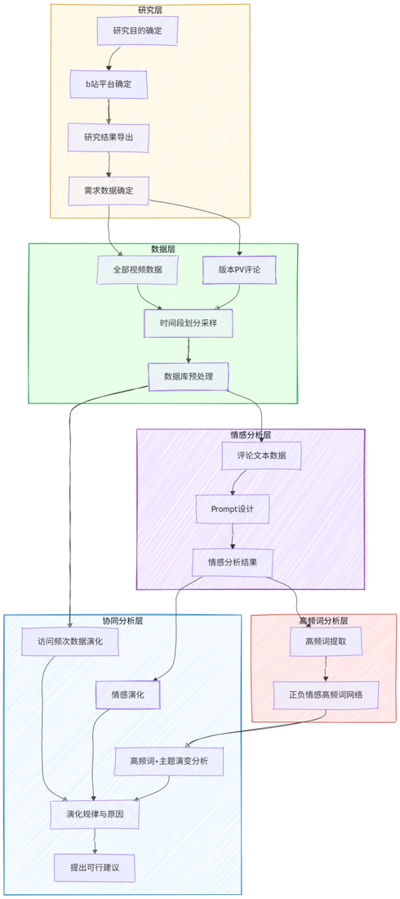

# B站崩坏星穹铁道社区分析

基于B站（Bilibili）数据对《崩坏：星穹铁道》玩家社区进行多维分析，覆盖从数据采集到可视化输出的完整流程。

## 流程图



## 项目结构

```
├── 数据爬取/           # 从B站API爬取视频信息和评论数据
├── 数据预处理/         # 数据清洗、入库、建索引和视图
├── 情感分析/           # 基于DeepSeek API的三分类情感分析
├── 视频分析/           # 视频维度分析（传播度/讨论度/喜爱度）及可视化
├── 高频词提取/         # 基于jieba分词的版本×情感高频词统计
└── README.md
```

## 分析流程

```
B站API → 爬取视频+评论 → SQLite入库 → 数据清洗 → 
    ├→ 情感分析(DeepSeek) → 情感高频词(jieba)
    └→ 视频维度分析 → 可视化图表
```

## 环境依赖

Python 3.8+，主要依赖：

| 包 | 用途 |
|---|---|
| requests | HTTP请求，调用B站API |
| pandas | 数据处理与分析 |
| openai | 调用DeepSeek API |
| jieba | 中文分词 |
| matplotlib | 可视化图表 |
| numpy | 数值计算 |
| scikit-learn | 模型评估指标 |
| sqlite3 | 本地数据库（内置） |

安装依赖：

```bash
pip install requests pandas openai jieba matplotlib numpy scikit-learn
```

## 运行步骤

### 1. 数据爬取

```bash
cd 数据爬取
python bilibili_scraper.py          # 爬取官方账号视频列表
python bilibili_comment_scraper.py  # 爬取指定视频评论（需命令行参数）
python batch_comment_scraper.py     # 批量爬取各版本PV评论
python import_to_sql.py             # 将CSV评论导入SQLite数据库
```

### 2. 数据预处理

```bash
cd 数据预处理
python preprocess.py    # 列精简、建索引、建视图、导出CSV
```

### 3. 情感分析

```bash
cd 情感分析
python sample_for_annotation.py   # 生成标注抽样模板
# 手动标注后将 标注模板_待标注.csv 另存为 标注模板_AI优化.csv 并填写情感标注列
python train_and_predict.py       # 评估DeepSeek情感分类效果
python predict_all.py             # 全量预测并入库
```

### 4. 视频分析

```bash
cd 视频分析
python video_dimension_analysis.py  # 版本维度分析 + 趋势图/热力图/雷达图
python video_top_detail.py          # 各版本Top3明细 + 全版本Top10极值
```

### 5. 高频词提取

```bash
cd 高频词提取
python jieba高频词提取.py  # 版本×情感高频词 + 全版本情感高频词
```

## 前置配置

运行前需在以下位置填写你的个人凭证：

| 文件 | 需要填写 |
|---|---|
| `数据爬取/bilibili_scraper.py` | `UID` 和 `COOKIE` (B站Cookie) |
| `数据爬取/bilibili_comment_scraper.py` | `COOKIE` (B站Cookie) |
| `情感分析/predict_all.py` | `API_KEY` (DeepSeek API Key) |
| `情感分析/train_and_predict.py` | `API_KEY` (DeepSeek API Key) |

> ⚠️ 切勿将包含真实凭证的代码提交到公开仓库。

## 注意事项

- B站API有频率限制，爬虫已内置随机延时，请勿过度调整sleep时间。
- 各脚本之间的数据库通过相对路径自动关联，只需保持项目目录结构不变即可。
